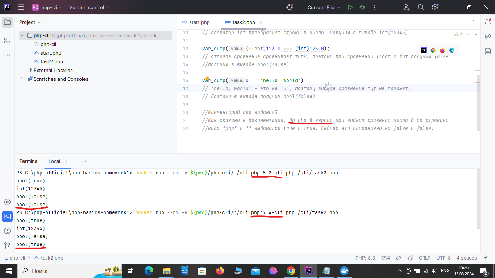

# PHP BASICS. Workshop 1. Homework. Тогочакова Евгения

## Задание 1. Собрать для себя окружение из Nginx + PHP-FPM и PHP CLI
Собираю PHP CLI
```
docker run --rm -v ${pwd}/php-cli/:/cli php:8.2-cli php /cli/start.php
```


[Code](./php-cli/start.php)

Собираю Nginx + PHP-FPM


[Code](./php-fpm)


## Задание 2. Выполните код в контейнере PHP CLI и объясните, что выведет данный код и почему:

```
<?php
$a = 5;
$b = '05';
var_dump($a == $b);
var_dump((int)'012345');
var_dump((float)123.0 === (int)123.0);
var_dump(0 == 'hello, world');
?>
```
```
docker run --rm -v ${pwd}/php-cli/:/cli php:8.2-cli php /cli/task2.php
```


[Code with my interpretation](./php-cli/task2.php)

## Задание 3. В контейнере с PHP CLI поменяйте версию PHP с 8.2 на 7.4. Изменится ли вывод?

```
docker run --rm -v ${pwd}/php-cli/:/cli php:7.4-cli php /cli/task2.php
```


## Задание 4.Используя только две числовые переменные, поменяйте их значение местами. Например, если a = 1, b = 2, 
надо, чтобы получилось: b = 1, a = 2. 
Дополнительные переменные, функции и конструкции типа list() использовать нельзя.

[Code](./task4/task4.php)